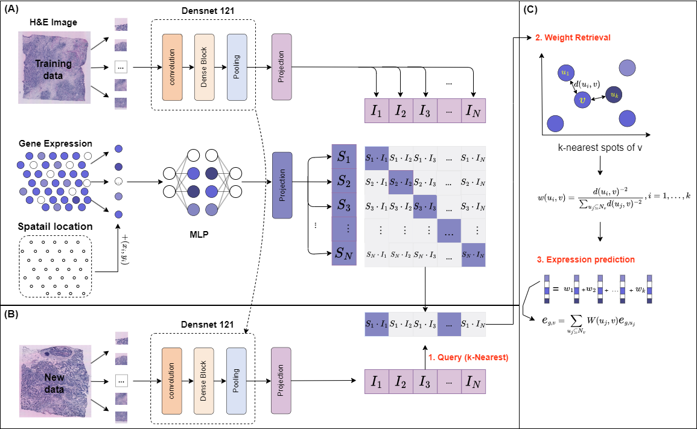

# Spatial gene expression prediction from histology images with STco
### Zhiceng Shi, Changmiao Wang, Wen Wen Min*
## Introduction
In this study, we introduce a novel approach: STco, a multi-modal deep learning method that operates within a contrastive learning framework. STco adeptly assimilates multi-modal data, encompassing histological images, gene expression profiles of individual spots, their precise spatial coordinates, and techniques to compile gene expression data. Our method leverages spatial transcriptomics datasets obtained from two distinct tumors using the 10X Genomics platform : these include human HER2-positive breast cancer (HER2+) and human cutaneous squamous cell carcinoma (cSCC) . The empirical results of our study underscore the enhanced performance of STco in accurately predicting gene expression profiles based on histological images, surpassing the capabilities of existing methods.

## System environment
Required package:
- PyTorch >= 2.1.0
- scanpy >= 1.8
- python >=3.9

# Datasets

 -  human HER2-positive breast tumor ST data https://github.com/almaan/her2st/.
 -  human cutaneous squamous cell carcinoma 10x Visium data (GSE144240).

## Get Started
- See  `Tutorial.ipynb`

