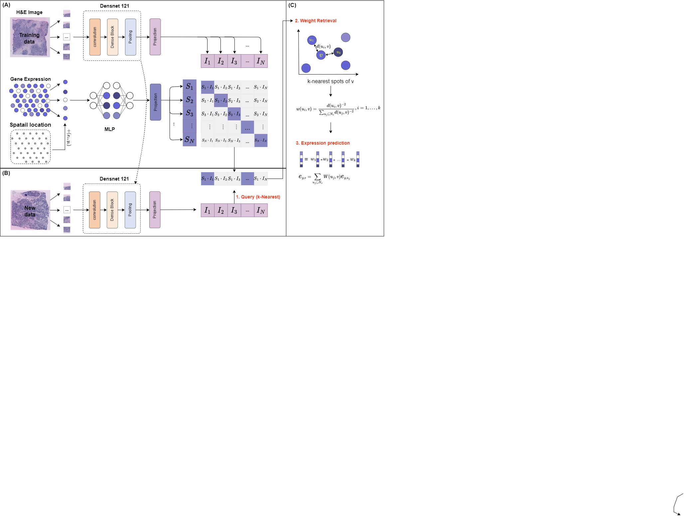

# Spatial gene expression prediction from histology images with STco
### Zhiceng Shi, Changmiao Wang, Wen Wen Min*


      




## System environment
Required package:
- PyTorch >= 2.1.0
- scanpy >= 1.8
- python >=3.9


# STco pipeline

See [tutorial.ipynb](tutorial.ipynb)


NOTE: Run the following command if you want to run the script tutorial.ipynb
 
1.  Please run the script `download.sh` in the folder [data](https://github.com/DDD1122/STco/tree/main/data) 

or 

Run the command line `git clone https://github.com/almaan/her2st.git` in the dir [data](https://github.com/DDD1122/STco/tree/main/data) 

2. Run `gunzip *.gz` in the dir `Hist2ST/data/her2st/data/ST-cnts/` to unzip the gz files


# Datasets

 -  human HER2-positive breast tumor ST data https://github.com/almaan/her2st/.
 -  human cutaneous squamous cell carcinoma 10x Visium data (GSE144240).


# Citation

Please cite our paper:

```


```
